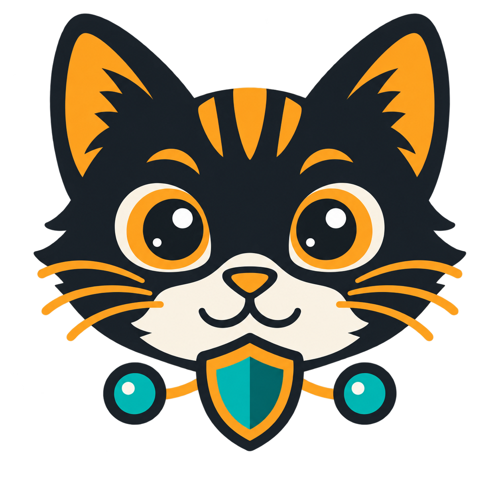

<p align="center"></p>

# cicig

`cicig` — установка одной командой двух VPN-сервисов и единой русскоязычной панели управления:

- `panel.example.com:443/tcp` — единая веб-панель cicig;
- `example.com:51820/udp` — адрес WireGuard в клиентских конфигурациях;
- `example.com:443/udp` — адрес AmneziaWG в клиентских конфигурациях;
- Caddy автоматически получает и продлевает HTTPS-сертификат.

HTTP/3 отключён, потому что UDP-порт 443 используется AmneziaWG.

## Быстрая установка

Запустите на чистом сервере от пользователя с правами `root`:

```bash
curl -fsSL https://raw.githubusercontent.com/oitarho/cicig/main/install.sh | sudo bash
```

Установщик попросит указать основной домен, например `mydomain.com`. Поддомен `panel.mydomain.com` он сформирует самостоятельно. Перед изменением сервера установщик покажет две необходимые DNS-записи типа A и будет проверять их, пока обе не начнут указывать на публичный IPv4 сервера.

Если DNS управляется через Cloudflare, для обеих записей нужно выбрать **DNS only** — серое облако. Проксирование Cloudflare не пропускает необходимый VPN-трафик UDP.

После успешной проверки DNS установщик:

1. Установит Docker и Docker Compose, если их ещё нет.
2. Попросит пароль администратора панели.
3. Загрузит проект в `/opt/cicig`.
4. Создаст защищённый файл `.env`.
5. Запустит Caddy, панель cicig, WireGuard и AmneziaWG.

## Возможности панели

- общий список клиентов WireGuard и AmneziaWG;
- создание клиента со сроком доступа и заметкой;
- поиск по имени, IP и публичному ключу;
- фильтрация по VPN, сроку и состоянию связи;
- статусы «онлайн», «недавно» и «офлайн»;
- отдельная карточка клиента с IP, ключом, трафиком и датами;
- QR-код и скачивание файла `.conf`;
- продление, включение, отключение и удаление клиента;
- автоматическое отключение просроченных клиентов;
- состояние всех сервисов;
- ручное и автоматическое обновление всей системы.

## Обновление всей системы

Кнопка **«Обновить всю систему сейчас»** загружает актуальную версию ветки `main` из GitHub, обновляет код панели и конфигурацию, загружает новые образы, пересобирает панель и перезапускает весь стек.

Автоматическое обновление выполняет ту же операцию через заданный интервал. Во время обновления панель может быть недоступна несколько секунд. Файл `.env`, HTTPS-сертификаты, база панели, VPN-ключи и клиенты хранятся отдельно и не удаляются.

Ручное обновление из терминала:

```bash
docker run --rm --name cicig-updater \
  -v /var/run/docker.sock:/var/run/docker.sock \
  -v /opt/cicig:/opt/cicig \
  docker:cli sh /opt/cicig/scripts/update.sh
```

## Системные требования

- Ubuntu 22.04/24.04 или Debian 12;
- публичный IPv4-адрес;
- A-записи основного домена и поддомена `panel`, направленные прямо на сервер;
- свободные TCP-порты 80 и 443;
- свободные UDP-порты 443 и 51820;
- архитектура Linux `amd64` для используемого образа AmneziaWG.

## Полезные команды

Посмотреть состояние:

```bash
cd /opt/cicig
docker compose ps
```

Посмотреть журналы:

```bash
cd /opt/cicig
docker compose logs --tail=200
```

Перезапустить систему:

```bash
cd /opt/cicig
docker compose up -d
```

## Разработка

```bash
cp .env.example .env
docker compose config
docker compose up -d --build
```

Не добавляйте `.env`, VPN-ключи и сгенерированные данные в Git. Постоянные данные находятся в Docker volumes.

Панель имеет доступ к `/var/run/docker.sock`, потому что через неё выполняется обновление системы. Пароль панели фактически даёт административные возможности на сервере: используйте уникальный сложный пароль и своевременно устанавливайте обновления.

## Используемые проекты

- [wg-easy](https://github.com/wg-easy/wg-easy)
- [awg-easy](https://github.com/YokiToki/awg-easy)
- [Caddy](https://caddyserver.com/)
